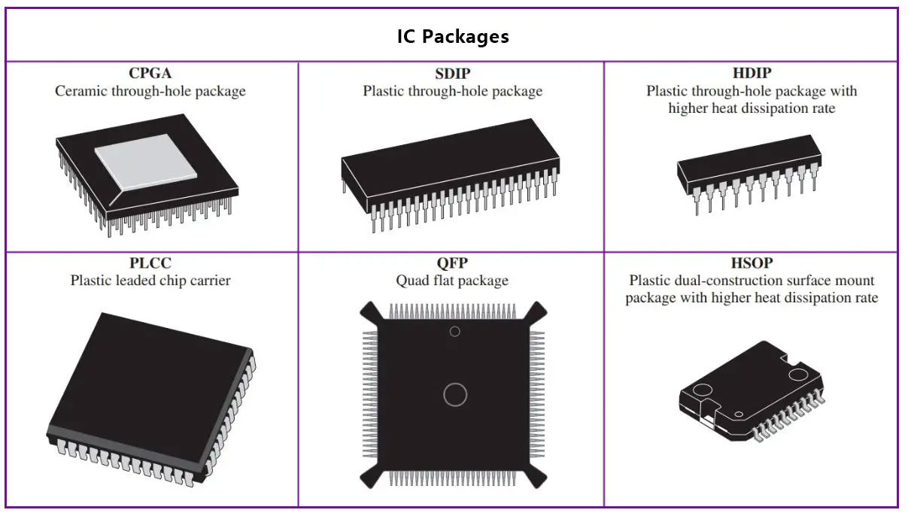

# Electronics 101
### How not to burn everything

<div class="absolute bottom-10">
    <span class="font-700">
        Réalisé par Antoine B.
    </span>
</div>

---
layout: image-right
image: './images/electronic.jpg'
---

# Les signaux éléctriques

<v-clicks>

* Numérique (digital)

<il>
    <li>tl;dr boolean</li>
    <br>
</il>

* Analogiques (analogue)

<il>
    <li>Dépend de la plage de tension (ici 5V)</li>
    <li>Variable entre 0 et 1023 (10 bits)</li>
    <li>2,5V = 512</li>
    <br>
</il>

<div>

## Un ennemi commun :
### Le signal flottant

* Signal non référencé à la masse ou une tension

</div>

* Résistances Pull-UP & Pull-DOWN

</v-clicks>

---
layout: image-right
image: './images/IC.jpg'
---

# Micro-controlleurs

    * ATmega328
    * ESP8266
    * ESP32

<br>
<br>

<v-clicks>

<div>

### Sous différents formats

<br>


</div>

</v-clicks>

---
layout: fact
---

# Arduino UNO

---
layout: image-right
image: './images/background.jpg'
---
# Carte de développement
<br>

* Utilise un ATmega328
* Alimentation intégrée
* Headers facilement accessibles
* Ports de débug exposés
* Sécurité supplémentaire (surtension, surpuissance)
* Programmation simplifié grâce à Arduino IDE

---

## Les composants

* Transistor

<v-clicks>

* Relais
* Resistance
* Capteur d'ultrason
* Servomoteurs

</v-clicks>

<br>

<v-clicks>

<div>

## Les outils

* Multimètre

</div>

</v-clicks>

<v-clicks>

* Serial monitor
* Datasheet

</v-clicks>


---
layout: fact
---

# Les ateliers

---

# Atelier n°1
## Servomoteurs

* Conçu pour se déplacer précisément à une position et la maintenir
* Rotation de 180° maximum

<br>
<br>

### Objectif :
Écrire un programme qui fait se déplacer le servomoteur d'une extrémité de son mouvement, à l'autre. 

---

# Atelier n°2
## Relais

* Dispositif électromécanique pour connecter/déconnecter une connection
* Connection isolé
* Dispositif physique donc temps de commutation à prendre en compte.

<br>
<br>

### Objectif : 
Écrire un programme qui peut commuter un circuit isolé à l'aide d'un bouton.

---

# Atelier n°3
## Transistor

* Dispositif électronique pour connecter/déconnecter une connection
* Connection non-isolé
* Commutation quasi instantané (100 nanosecondes)

<br>
<br>

### Objectif :
Écrire un programme qui peut commuter une LED à l'aide d'un bouton.

---
layout: image-right
image: './images/layout.png'
---

# Outils et aides

github.com/Dawoox/  
HUB-Workshop-Micro-Controllers

```cpp
void setup {
    // S'éxécute à l'initialisation
}

void loop {
    // S'éxécute indéfiniment
}
```

<br>
    
```cpp
// Lire l'état d'un signal digital sur un PIN
digitalRead(pin);
// Lire l'état d'un signal analogique sur un PIN
analogRead(pin);
// Ecrire l'état d'un PIN numérique
digitalWrite(pin, value); /*(value= HIGH ou LOW)*/
// Ecrire l'état d'un PIN analogue
analogWrite(pin, value); /*(value 0-1023)*/
```

---

# Outils et aides : Atelier n°1

> Attention! Vous devez installer la lib Servo

Configuration minimale pour un servomoteur
```cpp
#include <Servo.h>

Servo monServo;

void setup {
    monServo.attach(pin);
}

void loop {
    monServo.write(position);
}
```

Documentation Arduino: https://docs.arduino.cc/libraries/servo/

---
layout: image-right
image: './images/relay.png'
backgroundSize: contain
---

# Outils et aides : Atelier n°2

Câblage type

```cpp
// Ecrire l'état d'un PIN numérique
digitalWrite(pin, value); /*(value= HIGH ou LOW)*/
// Attendre x millisecondes
delay(ms);
```

---
layout: image-right
image: './images/schema_transistor.png'
backgroundSize: contain
---

# Outils et aides : Atelier n°3

Schéma transistor

```cpp
// Ecrire l'état d'un PIN numérique
digitalWrite(pin, value); /*(value= HIGH ou LOW)*/
// Attendre x millisecondes
delay(ms);
```

<br>

- Le PIN B doit être connecté à la masse  
- Le PIN C à la LED  
- Le PIN E à un port digital de l'Arduino  

<br>

> Attention au signal flottant !

### Documentation technique :
https://www.alldatasheet.com/datasheet-pdf/view/20088/POINN/BD651.html

---

# Atelier n°4 (Bonus)
## Capteur de distance

* Détection de distance grâce aux ultrasons
* Faible précision
* Dépend de la réfléction sonore de l'objet en face

<br>
<br>

### Objectif :
Écrire un programme qui écrit dans le serial monitor la distance détectée

### Documentation arduino :
https://docs.arduino.cc/built-in-examples/sensors/Ping/
